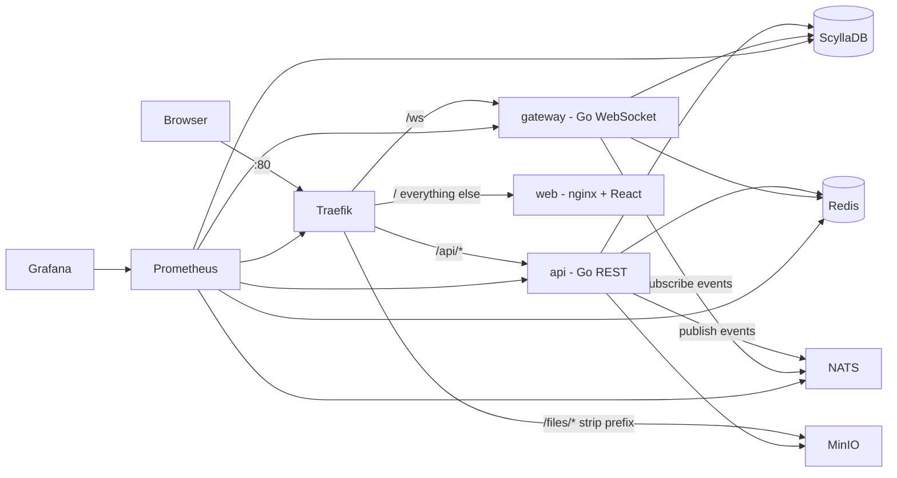

# Discurd

**Discurd — a Discord-style chat platform in Go + ScyllaDB.**

Realtime chat with guilds, channels, invites and presence — built as a small set of
stateless Go services on top of ScyllaDB, Redis, NATS and MinIO, fronted by Traefik and
observed with Prometheus + Grafana. The whole stack runs with one `docker compose up`.

## Features

- **Realtime WebSocket gateway** — identify/heartbeat protocol, event dispatch by guild
  membership, reconnect-friendly
- **Guilds, channels, invites** — create guilds, add channels (owner), join via 8-char
  invite codes
- **Messages with Discord-style Scylla bucketing** — `(channel_id, bucket)` partitions
  (10-day buckets) keep partitions bounded; newest-first paging walks buckets downward
- **Presence & typing indicators** — Redis-backed presence with online/offline broadcast,
  `TYPING_START` fan-out
- **Voice & video channels** — real-time audio/video via a LiveKit WebRTC SFU; voice
  channels in the sidebar with mic/camera/screen-share, video tiles, and speaking
  indicators (needs an HTTPS or `localhost` origin for camera/mic — see below)
- **Attachments & avatars via MinIO** — uploads through the API, downloads through
  Traefik at relative `/files/...` URLs
- **JWT auth with refresh rotation** — short-lived access tokens, opaque rotating refresh
  tokens stored in Redis
- **Rate limiting** — Redis fixed-window limiter (global + per-channel message limits)
- **Prometheus / Grafana observability** — contract-named metrics, auto-provisioned
  dashboard, Redis/NATS/Traefik exporters
- **Traefik edge** — single entrypoint on `:80` routing `/api`, `/ws`, `/files`, `/`
- **Horizontal scaling** — stateless api/gateway replicas + 3-node Scylla via a compose
  overlay; Kubernetes manifests included

## Architecture



- **api** — stateless REST service (auth, users, guilds, channels, messages, invites,
  uploads). Publishes realtime events to NATS.
- **gateway** — stateless WebSocket service. Authenticates sockets, subscribes to
  `discurd.events.>` on NATS, routes events to sessions by guild membership, maintains
  presence in Redis.
- **web** — nginx serving the built React SPA.

The full contract (API shapes, WS protocol, events, env vars, metrics) lives in
[docs/ARCHITECTURE.md](docs/ARCHITECTURE.md).

## Prerequisites

- [Docker Desktop](https://www.docker.com/products/docker-desktop/) — that's it.
  Everything (including builds) runs in containers.

## Quickstart

```sh
cp .env.example .env
docker compose up -d --build
```

The first run pulls and builds a lot of images — give it a few minutes. ScyllaDB takes
~30–60 s to report healthy; `scylla-init` and `minio-init` then apply the schema and
bucket policies, and only after that do `api`/`gateway` start. Watch progress with
`docker compose ps` or `docker compose logs -f`.

Open **http://localhost** — register a user, or seed demo data first:

```sh
docker compose exec api /app/seed    # or: make seed
```

The seeder creates the guild **Discurd HQ** with channels **#general**, **#random**,
**#dev** and three demo accounts (password `password123` for all):

| Email | Password |
|---|---|
| `alice@discurd.dev` | `password123` |
| `bob@discurd.dev` | `password123` |
| `charlie@discurd.dev` | `password123` |

Log in as two of them in two browser windows to see realtime messages, typing
indicators and presence dots.

## Host URLs

| URL | What |
|-----|------|
| http://localhost | Web app (Traefik entrypoint; also `/api`, `/ws`, `/files`) |
| http://localhost:8090 | Traefik dashboard |
| http://localhost:3000 | Grafana (`admin`/`admin`) |
| http://localhost:9090 | Prometheus |
| http://localhost:9001 | MinIO console (`minioadmin`/`minioadmin`) |
| localhost:9042 | ScyllaDB CQL (cqlsh, tooling) |
| localhost:6379 / 4222 / 8222 | Redis / NATS client / NATS monitoring |

## Development

### Hot-reload web app

Keep the Docker stack running, then:

```sh
cd web
npm install
npm run dev
```

Open http://localhost:5173. The Vite dev server proxies `/api`, `/ws` and `/files` to
the stack on `http://localhost` (Traefik), so the SPA hot-reloads while talking to the
real backend. (`CORS_ORIGINS` defaults to `http://localhost:5173` for exactly this.)

### Running the Go services on the host

Scylla (9042), Redis (6379) and NATS (4222) are already published to the host. MinIO's
S3 port is not — publish it with a local `docker-compose.override.yml` (auto-merged by
compose, don't commit it):

```yaml
services:
  minio:
    ports:
      - "9000:9000"
```

Start just the infrastructure, then run a service from `backend/`:

```sh
docker compose up -d scylla scylla-init redis nats minio minio-init

cd backend
PORT=8080 SERVICE_NAME=api \
SCYLLA_HOSTS=localhost SCYLLA_KEYSPACE=discurd \
REDIS_ADDR=localhost:6379 NATS_URL=nats://localhost:4222 \
MINIO_ENDPOINT=localhost:9000 MINIO_ROOT_USER=minioadmin MINIO_ROOT_PASSWORD=minioadmin \
JWT_SECRET=dev-secret-change-me-please-0123456789abcdef \
go run ./cmd/api
```

Same pattern for the gateway (`SERVICE_NAME=gateway`, pick another port such as
`PORT=8081`, no MinIO vars needed). Point the Vite proxy at your host-run service
instead of Traefik when developing this way.

## Scaling

A compose overlay grows the stack on a single host — 3-node Scylla ring plus api/gateway
replicas:

```sh
docker compose -f docker-compose.yml -f docker-compose.scale.yml up -d
```

Once all Scylla nodes show `UN` in `docker compose exec scylla nodetool status`, move the
keyspace to real replication and repair:

```sh
docker compose exec scylla cqlsh -e \
  "ALTER KEYSPACE discurd WITH replication = {'class': 'NetworkTopologyStrategy', 'datacenter1': 3};"

# run a repair on every scylla node so existing data reaches its new replicas
# (service names are scylla, scylla-node2, scylla-node3 — both files are needed
# for `ps --services` to list the overlay nodes)
for s in $(docker compose -f docker-compose.yml -f docker-compose.scale.yml ps --services | grep -E '^scylla(-node[0-9]+)?$'); do
  docker compose -f docker-compose.yml -f docker-compose.scale.yml exec "$s" nodetool repair -pr discurd
done
```

Traefik's Docker provider registers every replica of a compose service as a backend of
the same router, so `/api` and `/ws` are round-robin load-balanced automatically —
api and gateway are stateless (JWT verification is local; refresh tokens, presence and
rate limits live in Redis; NATS fans events out to every gateway instance), so any
replica can serve any user. Full details in [docs/DEPLOYMENT.md](docs/DEPLOYMENT.md).

## Observability

- **Grafana** (http://localhost:3000, `admin`/`admin`) — the Discurd dashboard is
  auto-provisioned: request rates/latency, WS connections, events dispatched, messages
  created, plus Redis/NATS/Traefik panels.
- **Prometheus** (http://localhost:9090) — check *Status → Targets*; it scrapes api,
  gateway, Traefik, Scylla, and the Redis/NATS exporters.
- Contract metric names (see [docs/ARCHITECTURE.md](docs/ARCHITECTURE.md) §11):
  `discurd_http_requests_total`, `discurd_http_request_duration_seconds`,
  `discurd_ws_connections`, `discurd_ws_events_dispatched_total`,
  `discurd_messages_created_total`.

## Project structure

```
discurd/
├── docker-compose.yml           # main stack
├── docker-compose.scale.yml     # overlay: 3-node scylla + service replicas
├── .env.example
├── Makefile
├── docs/
│   ├── ARCHITECTURE.md          # the binding contract (API, WS, events, env, metrics)
│   └── DEPLOYMENT.md            # scaling + production deploy guide
├── db/
│   └── schema.cql               # keyspace + tables (applied by scylla-init)
├── backend/                     # single Go module: discurd
│   ├── Dockerfile.api / Dockerfile.gateway
│   ├── cmd/api | cmd/gateway | cmd/seed
│   └── internal/                # config, models, store, auth, events, presence,
│                                # ratelimit, httpapi, ws, objstore, obs
├── web/                         # React SPA (Vite) → nginx image
├── deploy/
│   ├── prometheus/              # scrape config
│   ├── grafana/provisioning/    # datasource + dashboards
│   └── k8s/                     # Kubernetes manifests (see deploy/k8s/README.md)
└── scripts/                     # helper scripts
```

## Documentation

- [docs/ARCHITECTURE.md](docs/ARCHITECTURE.md) — the binding contract: REST API, WebSocket
  protocol, NATS events, data model, env vars, metrics, ports.
- [docs/DEPLOYMENT.md](docs/DEPLOYMENT.md) — local → scaled → production, plus Kubernetes.
- [deploy/k8s/README.md](deploy/k8s/README.md) — manifest apply order and infra wiring.

## Roadmap

Documented, not built in v1: DM channels, roles/permissions beyond owner, message
reactions, search (Elasticsearch), push notifications, federation of gateway shards.

**Shipped since v1:** voice & video channels (LiveKit WebRTC SFU) — create a channel with
type "voice", click to join. Note browsers only allow camera/mic on an **HTTPS** or
`localhost` origin, so on a bare `http://<ip>` deployment you must terminate TLS (self-signed
on an IP, or Let's Encrypt with a domain) for capture to work. See
[docs/DEPLOYMENT.md](docs/DEPLOYMENT.md).
