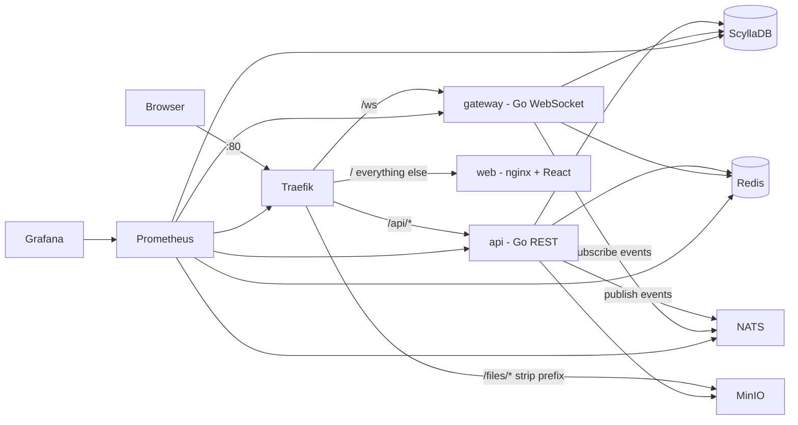

# Discurd — Architecture & Contracts

Discurd is a Discord-style chat platform: Go microservices, ScyllaDB for message storage
(the same pattern Discord itself uses), Redis for presence/sessions/rate-limits, NATS for
event fan-out, MinIO for file storage, a React web app, all fronted by Traefik and observed
with Prometheus + Grafana.

**This document is the binding contract.** Every service, the web app, dashboards, and
deployment tooling MUST match the shapes, names, ports, and env vars defined here.

---

## 1. Topology



- **api** — stateless REST service. Auth, users, guilds, channels, messages, invites, uploads.
  Publishes realtime events to NATS. Horizontally scalable.
- **gateway** — stateless WebSocket service. Authenticates sockets, subscribes to
  `discurd.events.>` on NATS, routes events to connected sessions by guild membership,
  maintains presence in Redis. Horizontally scalable (fan-out via NATS means any instance
  serves any user).
- **web** — nginx serving the built React SPA.

## 2. Repository layout & ownership

```
discurd/
├── docker-compose.yml           # main stack (authored, do not restructure)
├── docker-compose.scale.yml     # overlay: 3-node scylla + service replicas
├── .env.example
├── Makefile
├── README.md
├── docs/
│   ├── ARCHITECTURE.md          # this file
│   └── DEPLOYMENT.md            # scaling + production deploy guide
├── db/
│   └── schema.cql               # keyspace + tables (applied by scylla-init)
├── backend/                     # single Go module: module discurd
│   ├── go.mod / go.sum
│   ├── Dockerfile.api
│   ├── Dockerfile.gateway
│   ├── cmd/api/main.go
│   ├── cmd/gateway/main.go
│   ├── cmd/seed/main.go         # demo-data seeder, drives the public HTTP API
│   └── internal/
│       ├── config/              # env parsing
│       ├── models/              # domain structs + JSON shapes
│       ├── store/               # scylla repositories (interfaces + impl)
│       ├── auth/                # bcrypt, JWT, refresh tokens (redis)
│       ├── events/              # NATS publish/subscribe, event envelope
│       ├── presence/            # redis presence
│       ├── ratelimit/           # redis fixed-window limiter middleware
│       ├── httpapi/             # REST handlers, middleware, router
│       ├── ws/                  # gateway hub, sessions, dispatch
│       ├── objstore/            # minio client (uploads)
│       └── obs/                 # slog setup, prometheus metrics, health handlers
├── web/                         # React SPA (Vite)
│   ├── Dockerfile               # multi-stage: node build → nginx
│   ├── nginx.conf
│   └── src/...
├── deploy/
│   ├── prometheus/prometheus.yml
│   ├── grafana/provisioning/    # datasource + dashboards (auto-provisioned)
│   └── k8s/                     # Kubernetes manifests for production
└── scripts/                     # helper scripts
```

Go module path is `discurd` (e.g. `import "discurd/internal/store"`).

## 3. Libraries (backend)

| Concern    | Library |
|------------|---------|
| Router     | `github.com/go-chi/chi/v5` |
| Scylla     | `github.com/gocql/gocql` |
| WebSocket  | `github.com/gorilla/websocket` |
| NATS       | `github.com/nats-io/nats.go` |
| Redis      | `github.com/redis/go-redis/v9` |
| JWT        | `github.com/golang-jwt/jwt/v5` |
| Passwords  | `golang.org/x/crypto/bcrypt` (cost 10) |
| Objects    | `github.com/minio/minio-go/v7` |
| Metrics    | `github.com/prometheus/client_golang` |
| Logging    | stdlib `log/slog` (JSON handler) |

## 4. Data model (ScyllaDB)

Keyspace `discurd`. See `db/schema.cql` for the authoritative DDL. Key design points:

- Entity IDs are `uuid` (random v4). **Message IDs are `timeuuid`** (v1, time-ordered).
- Messages use Discord's bucketing pattern to bound partition size:
  `PRIMARY KEY ((channel_id, bucket), message_id)` with `CLUSTERING ORDER BY (message_id DESC)`.
  - `bucket = floor(unix_millis / 864_000_000)` — **10-day buckets**.
  - Writing: compute bucket from the message's timeuuid timestamp.
  - Reading (newest-first, `limit` max 100): start at `bucket(before_ts or now)`, page within
    the bucket (`message_id < before` when given), then walk buckets downward until the limit
    is filled or `bucket < bucket(channel.created_at)`.
- Uniqueness of email/username enforced with LWT (`INSERT ... IF NOT EXISTS`) into
  `users_by_email` / `users_by_username` before inserting `users`.
- Membership is written both directions: `guild_members` (by guild) and `user_guilds` (by user).
- `channels` is clustered under guild for listing; `channels_by_id` is the lookup-by-id
  denormalization (needed by message endpoints for permission checks).

## 5. Redis keys

| Key | Type | TTL | Purpose |
|-----|------|-----|---------|
| `refresh:{token}` | string → user_id | 168h | opaque refresh tokens, rotated on use |
| `presence:{user_id}` | string `"online"` | 70s | set on identify, refreshed on heartbeat |
| `presence_conns:{user_id}` | int counter | 120s | open-socket count; offline broadcast when it hits 0 |
| `rl:{scope}:{id}:{window}` | int counter | window | fixed-window rate limiting |

## 6. NATS events

Subjects:
- `discurd.events.guild.{guild_id}` — guild-scoped events.
- `discurd.events.user.{user_id}` — user-targeted events.

Envelope (JSON): `{"t": "<EVENT_TYPE>", "guild_id": "<uuid or empty>", "d": { ... }}`

| Event `t` | Subject scope | `d` payload |
|-----------|--------------|-------------|
| `MESSAGE_CREATE` | guild | full Message object |
| `MESSAGE_UPDATE` | guild | full Message object |
| `MESSAGE_DELETE` | guild | `{id, channel_id, guild_id}` |
| `TYPING_START` | guild | `{channel_id, guild_id, user_id, username}` |
| `CHANNEL_CREATE` | guild | full Channel object |
| `GUILD_MEMBER_ADD` | guild | Member object plus `guild_id` |
| `PRESENCE_UPDATE` | guild | `{user_id, guild_id, status: "online"\|"offline"}` |
| `GUILD_CREATE` | user | full Guild object (sent to a user who created/joined a guild) |
| `MESSAGE_REACTION_ADD` | guild | `{channel_id, message_id, emoji, user_id}` (see docs/FEATURES-v2.md) |
| `MESSAGE_REACTION_REMOVE` | guild | `{channel_id, message_id, emoji, user_id}` |
| `EFFECT` | guild | `{channel_id, guild_id, type, user_id}` — broadcast visual effect (lightning etc.) |

The gateway subscribes to `discurd.events.>`. For guild events it dispatches to sessions
whose user is a member of `guild_id` (each session caches its user's guild-id set at
identify time, refreshed when it receives that user's `GUILD_CREATE`). User events go to
that user's sessions only.

## 7. REST API contract (api service, port 8080)

All routes below are under `/api/v1`. JSON, snake_case. Authenticated routes require
`Authorization: Bearer <access_token>`.

Errors: status code + `{"error": {"code": "machine_code", "message": "human text"}}`.
Codes include: `validation_failed`, `invalid_credentials`, `unauthorized`, `forbidden`,
`not_found`, `conflict`, `rate_limited`, `too_large`, `internal`.

### Object shapes

```jsonc
// User (email present only on your own user)
{"id":"…","username":"…","email":"…","avatar_url":"/files/avatars/… or empty","created_at":"RFC3339"}
// Guild
{"id":"…","name":"…","owner_id":"…","icon_url":"","created_at":"RFC3339"}
// Channel  (type is "text" | "voice"; defaults to "text")
{"id":"…","guild_id":"…","name":"general","type":"text","topic":"","created_at":"RFC3339"}
// Member
{"user_id":"…","username":"…","avatar_url":"","joined_at":"RFC3339","status":"online|offline","is_owner":false}
// Message (author hydrated by the API from the users table — batch-fetch, don't N+1)
{"id":"<timeuuid>","channel_id":"…","guild_id":"…",
 "author":{"id":"…","username":"…","avatar_url":""},
 "content":"…","attachments":[{"url":"/files/attachments/…","filename":"…","size":123,"content_type":"image/png"}],
 "created_at":"RFC3339","edited_at":null}
// Invite
{"code":"8-char-base62","guild_id":"…","created_at":"RFC3339"}
```

### Endpoints

| Method & path | Auth | Body → Response |
|---|---|---|
| `POST /auth/register` | no | `{username,email,password}` → `201 {user, access_token, refresh_token}` |
| `POST /auth/login` | no | `{email,password}` → `{user, access_token, refresh_token}` |
| `POST /auth/refresh` | no | `{refresh_token}` → `{access_token, refresh_token}` (old refresh invalidated) |
| `POST /auth/logout` | yes | `{refresh_token}` → `204` |
| `GET /users/@me` | yes | → User (with email) |
| `PATCH /users/@me` | yes | `{username?}` → User |
| `POST /users/@me/avatar` | yes | multipart `file` → `{avatar_url}` (also updates user) |
| `GET /users/@me/guilds` | yes | → `[Guild]` |
| `POST /guilds` | yes | `{name}` → `201 Guild` (auto-creates `#general`; creator becomes owner+member; publishes `GUILD_CREATE` to user) |
| `GET /guilds/{guild_id}` | yes, member | → Guild |
| `GET /guilds/{guild_id}/channels` | yes, member | → `[Channel]` |
| `POST /guilds/{guild_id}/channels` | yes, owner | `{name, topic?, type?}` → `201 Channel` (`type` "text"\|"voice", default "text"; publishes `CHANNEL_CREATE`) |
| `GET /guilds/{guild_id}/members` | yes, member | → `[Member]` (presence via Redis `MGET`) |
| `POST /guilds/{guild_id}/invites` | yes, member | → `201 Invite` |
| `POST /invites/{code}/join` | yes | → Guild (idempotent; publishes `GUILD_MEMBER_ADD` to guild + `GUILD_CREATE` to joiner) |
| `GET /channels/{channel_id}/messages?limit=50&before={id}` | yes, member | → `[Message]` newest-first, limit ≤ 100 |
| `POST /channels/{channel_id}/messages` | yes, member | `{content, attachments?: [Attachment]}` → `201 Message` (publishes `MESSAGE_CREATE`) |
| `PATCH /channels/{channel_id}/messages/{message_id}` | yes, author | `{content}` → Message (publishes `MESSAGE_UPDATE`) |
| `DELETE /channels/{channel_id}/messages/{message_id}` | yes, author or guild owner | → `204` (publishes `MESSAGE_DELETE`) |
| `POST /channels/{channel_id}/typing` | yes, member | → `204` (publishes `TYPING_START`) |
| `POST /channels/{channel_id}/attachments` | yes, member | multipart `file` (≤ MAX_UPLOAD_MB) → `201 Attachment` |
| `POST /channels/{channel_id}/voice/token` | yes, member | → `201 {url, token, room}` — LiveKit join token (400 if channel `type` != "voice"); `room` = channel id, identity = user id |

Non-versioned: `GET /healthz` (liveness, always 200), `GET /readyz` (checks Scylla/Redis/NATS),
`GET /metrics` (Prometheus).

### Validation
- username: 2–32 chars, `[a-zA-Z0-9_]`; email: sane format, lowercased; password: ≥ 8 chars.
- guild name: 2–100 chars. channel name: 1–100 chars, server-side sanitized to
  lowercase with `-` for spaces. message content: 1–4000 chars (may be empty only if
  attachments are present). topic ≤ 1024.

### Rate limits (Redis fixed window, per user id — per IP when unauthenticated)
- Global API: 120 requests / 60s → `429` with code `rate_limited`.
- `POST …/messages`: 10 / 10s per user per channel.

## 8. WebSocket protocol (gateway service, port 8080, path `/ws`)

Client frames: `{"op": "identify", "d": {"token": "<access JWT>"}}` and `{"op": "heartbeat"}`.
Server frames:
- `{"op": "hello", "d": {"heartbeat_interval_ms": 30000}}` — sent on connect.
- `{"op": "heartbeat_ack"}`
- `{"op": "dispatch", "t": "<EVENT_TYPE>", "d": {...}}` — payloads exactly as in §6, plus:
- `{"op": "dispatch", "t": "READY", "d": {"user": User, "guild_ids": ["…"]}}` — after successful identify.

Rules: client must identify within 10s of connect (else close 4001); invalid token → close
4001; no heartbeat for 90s → close 4009. On identify the gateway `INCR`s
`presence_conns:{user}`, sets `presence:{user}`, and publishes `PRESENCE_UPDATE online` to
each of the user's guilds (only when the counter goes 0→1). Heartbeats refresh both TTLs.
On disconnect, `DECR`; at ≤ 0 delete the presence key and publish `PRESENCE_UPDATE offline`.

## 9. Object storage (MinIO)

Buckets `avatars` and `attachments`, anonymous **download-only** policy (set by minio-init).
Object keys: `avatars/{user_id}/{random}.{ext}`, `attachments/{channel_id}/{random}/{filename}`.
Stored/returned URLs are **relative**: `/files/{bucket}/{key}` — Traefik strips `/files`
and proxies to MinIO path-style, so URLs survive any deployment hostname.

## 9.5 Voice & video (LiveKit SFU)

Real-time audio/video uses **LiveKit** (an open-source WebRTC SFU) as a first-class
container. Channels have a `type`: `"text"` or `"voice"`. A voice channel maps 1:1 to a
LiveKit **room** whose name is the channel id.

- **Signaling** (WebSocket) is proxied by Traefik at `/livekit` (prefix stripped → LiveKit's
  `/rtc`), so it shares the app origin. The web app builds the URL from `window.location`
  (`ws(s)://<host>/livekit`) — no host is hard-coded, so it works on localhost, a bare IP,
  or a domain, over http or https.
- **Media** (SRTP) flows peer-to-SFU over UDP `7882` (mux) with a TCP fallback on `7881` —
  published on the host, *not* through Traefik. LiveKit advertises `LIVEKIT_NODE_IP` in its
  ICE candidates: `127.0.0.1` locally, the server's public IP in production.
- The api service mints a short-lived join token (signed with `LIVEKIT_API_SECRET`) via
  `POST /channels/{id}/voice/token`, granting `RoomJoin` on `room = channel id`, with
  `identity = user id`, name = username, and metadata = `{avatar_url}`.

**Secure-context requirement:** browsers only expose the camera/microphone
(`getUserMedia`) on `https://` origins or `localhost`. Serving on a bare `http://<ip>`
disables voice/video capture — production must terminate TLS (self-signed on an IP, or
Let's Encrypt once a domain is assigned). See docs/DEPLOYMENT.md.

## 10. Configuration (env vars — all services read these names)

| Var | Default | Used by |
|-----|---------|---------|
| `ENV` | `development` | both — `production` refuses a weak/built-in `JWT_SECRET` |
| `PORT` | `8080` | api, gateway |
| `SERVICE_NAME` | `api` / `gateway` | both (metrics/logs) |
| `SCYLLA_HOSTS` | `scylla` | comma-separated |
| `SCYLLA_KEYSPACE` | `discurd` | |
| `REDIS_ADDR` | `redis:6379` | |
| `NATS_URL` | `nats://nats:4222` | |
| `MINIO_ENDPOINT` | `minio:9000` | api |
| `MINIO_ROOT_USER` / `MINIO_ROOT_PASSWORD` | `minioadmin` | api |
| `MINIO_USE_SSL` | `false` | api |
| `LIVEKIT_API_KEY` | `devkey` | api (mints voice tokens) |
| `LIVEKIT_API_SECRET` | — (≥32 chars) | api |
| `LIVEKIT_WS_URL` | `ws://localhost/livekit` | api (hint returned to clients; the web app derives its own from `window.location`) |
| `LIVEKIT_NODE_IP` | `127.0.0.1` | compose-level — the IP LiveKit advertises in ICE candidates (set to the server's public IP on deploy) |
| `TENOR_API_KEY` | `` (empty) | api — enables the GIF picker (docs/FEATURES-v2.md) |
| `TENOR_CLIENT_KEY` | `discurd` | api |
| `JWT_SECRET` | — (required) | both |
| `ACCESS_TOKEN_TTL` | `15m` | api |
| `REFRESH_TOKEN_TTL` | `168h` | api |
| `MAX_UPLOAD_MB` | `25` | api |
| `CORS_ORIGINS` | `http://localhost:5173` | api (comma-separated; through-Traefik traffic is same-origin) |
| `LOG_LEVEL` | `info` | both |

Services must retry infra connections (Scylla/Redis/NATS/MinIO) with backoff for ~60s at
startup rather than crash-looping instantly, and shut down gracefully on SIGTERM.

## 11. Metrics (names are contract — the Grafana dashboard binds to them)

- `discurd_http_requests_total{service,method,route,status}` (counter)
- `discurd_http_request_duration_seconds{service,route}` (histogram)
- `discurd_ws_connections{service}` (gauge)
- `discurd_ws_events_dispatched_total{service,type}` (counter)
- `discurd_messages_created_total` (counter, api)
- Plus default Go runtime metrics from client_golang.

## 12. Ports (host)

| URL | What |
|-----|------|
| http://localhost | Web app (Traefik entrypoint; also `/api`, `/ws`, `/files`) |
| http://localhost:8090 | Traefik dashboard |
| http://localhost:3000 | Grafana (`admin`/`admin`) |
| http://localhost:9090 | Prometheus |
| http://localhost:9001 | MinIO console (`minioadmin`/`minioadmin`) |
| localhost:9042 | ScyllaDB CQL (cqlsh, tooling) |
| localhost:7881/tcp, 7882/udp | LiveKit media (ICE/TCP fallback + SRTP mux); signaling is via Traefik at `/livekit` |
| localhost:6379 / 4222 / 8222 | Redis / NATS client / NATS monitoring |

## 13. Web app (React SPA)

Vite + React 18 + `react-router-dom` + `zustand`, plain CSS (Discord-style dark theme,
CSS variables). Talks to same-origin `/api/v1` and `ws(s)://host/ws`. Access token kept in
memory + localStorage refresh token with silent refresh on 401. Features: register/login,
guild sidebar with create/join (invite code) modals, channel list with create modal
(owner), message pane with infinite upward scroll, optimistic send, edit/delete own
messages, attachment upload with image previews, typing indicators, member list with
presence dots, avatar upload in a settings popover. WebSocket client implements §8 with
reconnect + resubscribe backoff.

## 14. Roadmap (documented, not built in v1)

DM channels, roles/permissions beyond owner, message reactions, search (Elasticsearch),
voice (WebRTC SFU, e.g. LiveKit), push notifications, federation of gateway shards.
